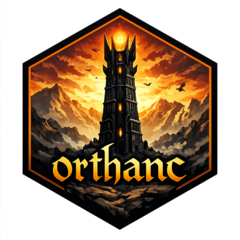

```{r, include = FALSE}
knitr::opts_chunk$set(
  collapse = TRUE,
  comment = "#>",
  fig.path = "man/figures/README-",
  out.width = "100%"
)
```

# orthanc 

<!-- badges: start -->
[](https://lifecycle.r-lib.org/articles/stages.html#experimental)
[](https://github.com/mattwarkentin/orthanc/actions/workflows/R-CMD-check.yaml)
<!-- badges: end -->

`orthanc` is an R package that provides a programmatic interface to [Orthanc](https://orthanc.uclouvain.be) DICOM Servers to support medical imaging workflows for the R language. Inspired by the design and usability of the [`PyOrthanc`](https://github.com/gacou54/pyorthanc) Python package, `orthanc` enables R users to interact with Orthanc servers using familiar R paradigms.

The package provides comprehensive and user-friendly access to the Orthanc REST API, designed to align with idiomatic R workflows while preserving the structure and semantics of DICOM resources.

`orthanc` provides:

+ Comprehensive wrapping of the Orthanc REST API endpoints using [`httr2`](https://httr2.r-lib.org)

+ Asynchronous client support using [`mirai`](https://mirai.r-lib.org)

+ Object-oriented representations of hierarchical DICOM resources using [`R6`](https://r6.r-lib.org)

+ High-level utility functions for performing common DICOM operations including querying, filtering, managing, modifying, and exporting DICOM data

## Installation

You can install the development version of `orthanc` from [GitHub](https://github.com/mattwarkentin/orthanc) with:

``` r
# install.packages("pak")
pak::pak("mattwarkentin/orthanc")
```

## Basic Usage

```{r}
#| label: setup
#| include: false
options(max.print = 5)
```

```{r}
library(orthanc)

client <- Orthanc$new("https://orthanc.uclouvain.be/demo")

instances <- client$get_instances()

instances
```

```{r}
instance <- Instance$new(instances[[1]], client)
instance

instance$main_dicom_tags
```

## Acknowledgements

I gratefully acknowledge the authors and maintainers of Orthanc for developing and maintaining an open-source, standards-compliant DICOM server that has become an essential tool in medical imaging research. I also thank the authors and contributors of `PyOrthanc`, whose work provided important conceptual and design inspiration for this package.

## Code of Conduct

Please note that the `orthanc` project is released with a [Contributor Code of Conduct](https://mattwarkentin.github.io/orthanc/CODE_OF_CONDUCT.html). By contributing to this project, you agree to abide by its terms.
